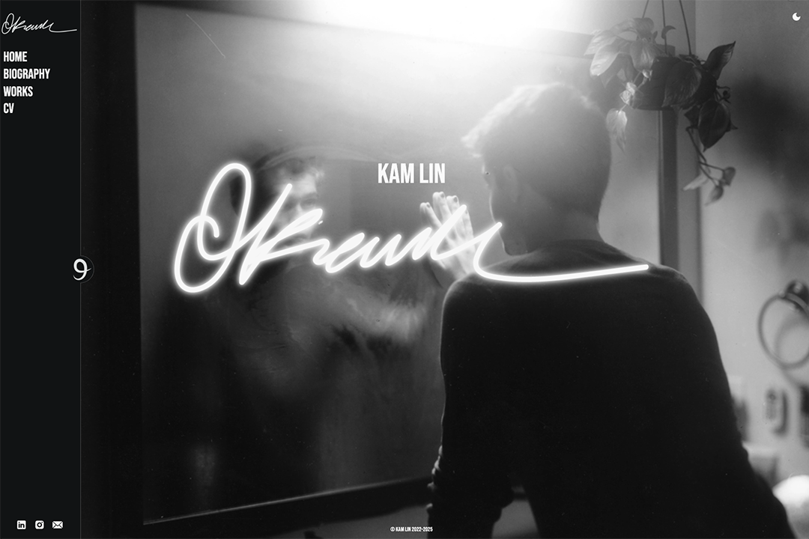

# A Minimalist Photography Portfolio Site - [See It Here!](kam-lin.com)

Made for the photographer Kam Lin, this is a portfolio website showcasing a variety of her works. It includes interactive photo galleries, light and dark modes, and is fully responsive on mobile devices.

## Development

Developed using React, the website is built to be lightweight and dynamic, offering a pleasant experience for the user while being easily modifiable by the developer for future additions. A global state is used throughout all pages to keep track of the current theme, status of the sidebar, and whether the device is considered to be mobile, all affecting various aspects of the user experience.

### Styling

Styling is done using Dart SASS to make use of the latest features implemented in SASS. These are seperated into CSS modules to be imported per-component to allow for a more modular design framework. Key colors and style variables are stored in the base style index to be used throughout the codebase to reduce repetition and ensure stylistic continuity between all elements and pages.

### Versioning

`bump2version` is used to manage the version of the site and its package details.

### Deployment

GitHub Pages is used for deploying the React app onto [kam-lin.com](kam-lin.com) through the use of the custom domain DNS feature.
